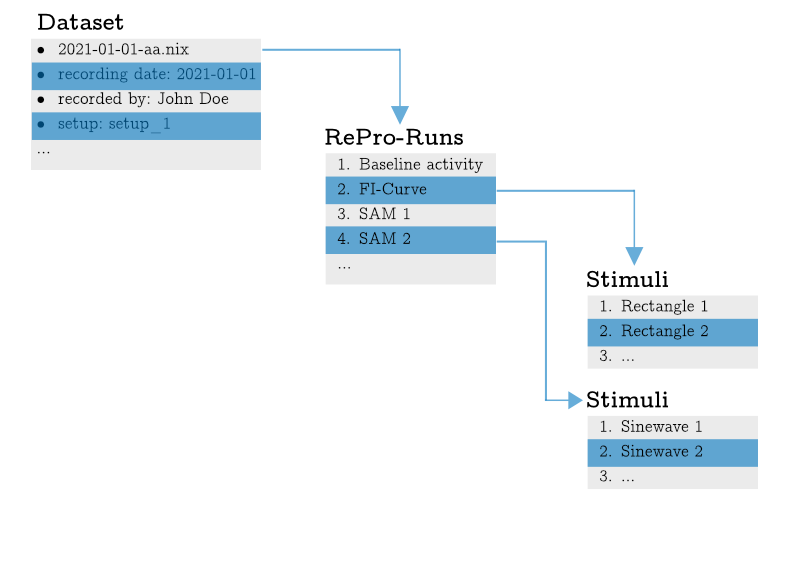

# Introduction

**rlxnix** objects represent the content of a relacs stored NIX file. The file content is modelled as three basic objects (see also figure 1).

1. The *Dataset*: This is the first and most important object that needs to be created by instantiation. The only parameter it expects is the name of the recorded **NIX** file. The Dataset then contains the top-level metadata, i.e. the information that was provided in the file save dialog **relacs** asks you to fill upon saving a file. The dataset further offers access to the the **Re**search**Pro**tocols that have been run.
2. *ReProRun*: Represents the run of a single RePro. It has properties such as the start and stop times of the RePro-run. The metadata contain the settings of the RePro. From here you can access the stimuli that have been applied during this run. For some **relacs** RePros there are equivalent classes in ``rlxnix`` which offer some RePro specific functionality. These classes inherit and extend the functionality offered by the ``rlxnix.base.repro.ReProRun`` class.
3. *Stimulus*: The Stimulus object offers access to the concrete stimulus settings (more metadata) and the data recorded during the stimulus presentations.

