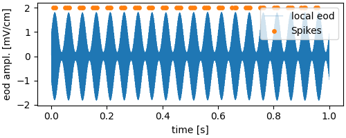

## ``rlxnix.base.Stimulus`` class represents stimulus segments

Ok, in this run of the *SAM* RePro, there are two stimulus segments. The stimulus segments are represented by instances of the ``rlxnix.base.Stimulus`` class.

```python
sam.stimuli
[Stimulus object for stimulus output from 10.9405 to 11.9405s of MultiTag 3340ffe5-3aa1-4b9c-a931-8860f25dac3a at 0x15a3918b0,
 Stimulus object for stimulus output from 12.0405 to 13.0405s of MultiTag 3340ffe5-3aa1-4b9c-a931-8860f25dac3a at 0x15a391280]

# let's take the first one
stimulus = sam.stimuli[0]

print(stimulus)
Stimulus: SAM, C=5%, Df=20.0Hz, AM-1     type: relacs.stimulus.segment
        start time: 10.94s, duration: 1.00s
```

While the metadata attached to the ``ReProRun`` contains the basic settings of the *relacs* RePro, the metadata attached to the stimulus contain information related to this particular stimulus segment.

```python
stimulus.metadata
{'SAM, C=5%, Df=20.0Hz, AM-1': {'Modality': (['electric'], ''),
  'SamplingRate': ([40.0], 'kHz'),
  'StartTime': ([0.0], 's'),
  'Duration': ([1.0], 's'),
  'Amplitude': ([1.0], 'V'),
  'Contrast': ([5.0], '%'),
  'Frequency': ([20.0], 'Hz'),
  'DeltaF': ([20.0], 'Hz'),
  'Phase': ([0.0], ''),
  'EODf': ([800.6268881023378], 'Hz')}}
```

To read the data we can apply exactly the same methods as before (for those interested, this functionality is inherited from the common ancestor, ``rlxnix.base.trace_container``).

```python
sam_stim_spike_times, _ = stimulus.trace_data("Spikes-1")
sam_stim_eod, sam_stim_time = stimulus.trace_data("LocalEOD-1")

fig, axis = plt.subplots(figsize=(5, 2), constrained_layout=True)
axis.plot(sam_stim_time, sam_stim_eod, lw=0.25, label="local eod")
axis.scatter(sam_stim_spike_times, np.ones_like(sam_stim_spike_times) * 1.1 * np.max(sam_stim_eod), color="tab:orange", s=15, label="Spikes")
axis.set_xlabel("time [s]")
axis.set_ylabel("eod ampl. [mV/cm]")
axis.legend(loc=1)
plt.show()
```



Voilà, now you are ready to go and dig into your data. The patterns shown above apply to any of the RePro classes in **rlxnix**, no matter whether they are RePro-specific classes or not. The specialized classes defined in e.g. ``rlxnix.plugins.efish`` just offer some more sugar.
